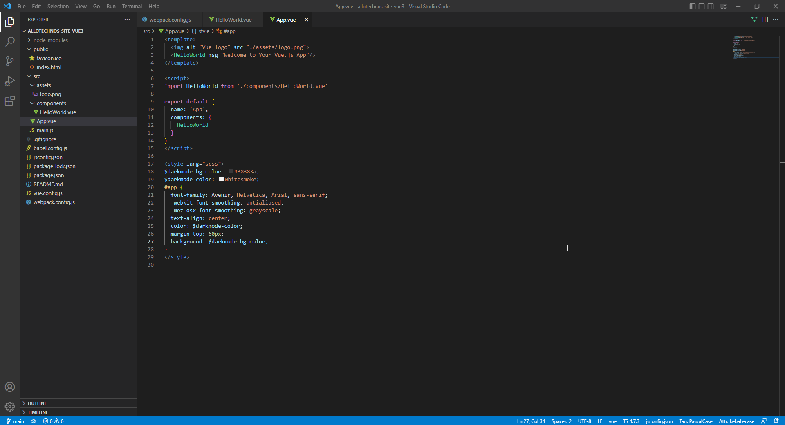
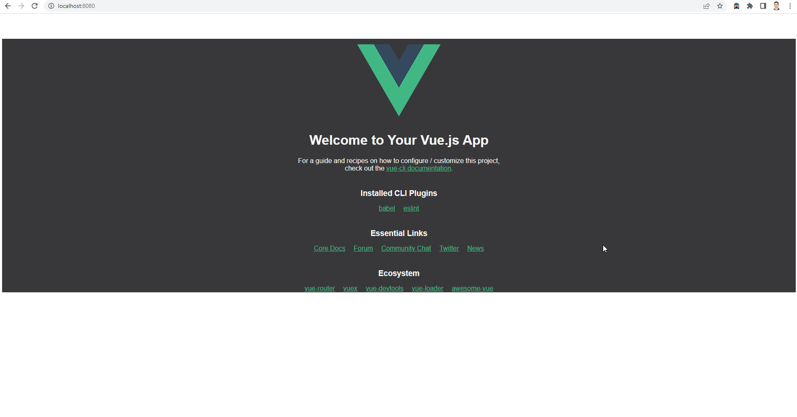

# Intro

There are two ways of starting a VUE project

* Add a script tag that points to the vuejs cdn
* Create a starting project with vue-cli

## First method

## Second method

https://vue-loader.vuejs.org/guide/pre-processors.html

Create `webpack.config.js` and paste the code of SCSS

Then add in style tag `lang="scss"`

The result

